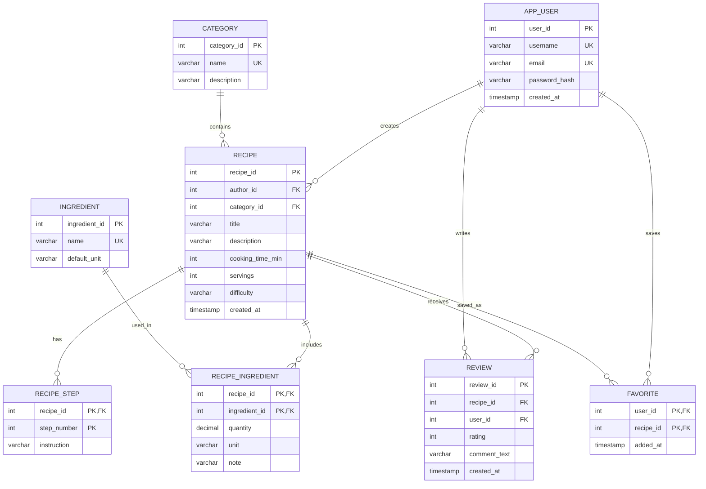

# ER-диаграмма в формате Mermaid

Этот файл можно вставить в Markdown-редактор с поддержкой Mermaid или использовать как основу для построения диаграммы в DBeaver/Data Modeler.

```mermaid
erDiagram
    APP_USER ||--o{ RECIPE : creates
    CATEGORY ||--o{ RECIPE : contains
    RECIPE ||--o{ RECIPE_INGREDIENT : includes
    INGREDIENT ||--o{ RECIPE_INGREDIENT : used_in
    RECIPE ||--o{ RECIPE_STEP : has
    RECIPE ||--o{ REVIEW : receives
    APP_USER ||--o{ REVIEW : writes
    APP_USER ||--o{ FAVORITE : saves
    RECIPE ||--o{ FAVORITE : saved_as

    APP_USER {
        int user_id PK
        varchar username UK
        varchar email UK
        varchar password_hash
        timestamp created_at
    }

    CATEGORY {
        int category_id PK
        varchar name UK
        varchar description
    }

    RECIPE {
        int recipe_id PK
        int author_id FK
        int category_id FK
        varchar title
        varchar description
        int cooking_time_min
        int servings
        varchar difficulty
        timestamp created_at
    }

    INGREDIENT {
        int ingredient_id PK
        varchar name UK
        varchar default_unit
    }

    RECIPE_INGREDIENT {
        int recipe_id PK, FK
        int ingredient_id PK, FK
        decimal quantity
        varchar unit
        varchar note
    }

    RECIPE_STEP {
        int recipe_id PK, FK
        int step_number PK
        varchar instruction
    }

    REVIEW {
        int review_id PK
        int recipe_id FK
        int user_id FK
        int rating
        varchar comment_text
        timestamp created_at
    }

    FAVORITE {
        int user_id PK, FK
        int recipe_id PK, FK
        timestamp added_at
    }
```
